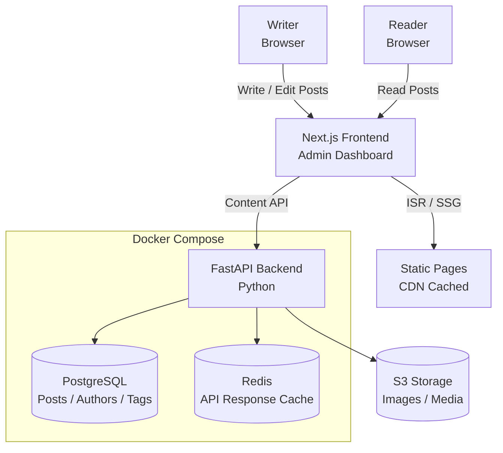

# ✍️ OpenBlog

**Headless CMS & Blogging Platform**

     

A self-hostable, open source headless CMS and blogging platform built for developers and technical writers. Markdown-first, API-driven, and deployable anywhere with no vendor lock-in.

---

## 📋 Overview

**The Problem:** WordPress is too heavy. Ghost is great but expensive to host. Most headless CMS options require vendor lock-in or complex setup for a simple technical blog.

**The Solution:** A self-hostable platform that:
- Stores content as Markdown in PostgreSQL with a clean REST API
- Ships a beautiful Next.js frontend with ISR out of the box
- Supports code syntax highlighting, MDX components, and LaTeX
- Handles image uploads to any S3-compatible storage
- Exports content to standard Markdown — no lock-in

---

## 🎯 Key Features

| Feature | Description |
|--------|-------------|
| **Markdown-First Editor** | TipTap rich text editor with raw Markdown toggle |
| **REST Content API** | Full CRUD API for posts, tags, authors, and media |
| **Next.js Frontend** | ISR for fast, SEO-optimized page loads |
| **Code Highlighting** | Syntax highlighting via Shiki for 100+ languages |
| **MDX Support** | Embed React components directly in posts |
| **S3 Media Storage** | Image uploads to any S3-compatible provider |
| **RSS + Sitemap** | Auto-generated RSS feed and XML sitemap |

---

## 📊 Performance

| Metric | Result |
|--------|--------|
| Lighthouse Performance | 97/100 |
| Time to First Byte (TTFB) | < 80ms (CDN cached) |
| API Response Time (p95) | < 120ms |
| GitHub Stars | 320+ |

---

## 🏗️ Architecture



---

## 🚀 Getting Started

### Prerequisites

- Python 3.11+
- Node.js 20+
- PostgreSQL 16+
- Redis (optional, for caching)
- Docker (recommended)

### Run with Docker Compose (recommended)

```bash
git clone https://github.com/brian-codington/openblog.git
cd openblog
cp .env.example .env
docker-compose up --build
# Frontend: http://localhost:3000
# API:      http://localhost:8000
# API Docs: http://localhost:8000/docs
```

### Run locally

```bash
# Backend
cd backend
pip install -r requirements.txt
uvicorn main:app --reload

# Frontend
cd frontend
npm install
npm run dev
```

---

## 📡 API Endpoints

| Method | Endpoint | Description |
|--------|----------|-------------|
| `GET` | `/api/posts` | List published posts |
| `POST` | `/api/posts` | Create a post |
| `GET` | `/api/posts/:slug` | Get post by slug |
| `PATCH` | `/api/posts/:id` | Update a post |
| `DELETE` | `/api/posts/:id` | Delete a post |
| `GET` | `/api/tags` | List all tags |
| `GET` | `/api/authors/:id` | Get author profile |
| `POST` | `/api/media/upload` | Upload an image |
| `GET` | `/rss.xml` | RSS feed |
| `GET` | `/sitemap.xml` | XML sitemap |

---

## 📁 Project Structure

```
openblog/
├── frontend/              # Next.js frontend
│   └── src/
│       ├── components/    # UI components
│       ├── pages/         # Next.js pages + API routes
│       ├── hooks/         # Custom React hooks
│       └── api/           # API client
├── backend/               # FastAPI backend
│   ├── api/
│   │   ├── routes/        # Route handlers
│   │   ├── models/        # SQLAlchemy models
│   │   └── schemas/       # Pydantic schemas
│   ├── core/              # Config, auth, storage
│   └── tests/
├── docker-compose.yml
├── .env.example
└── README.md
```

---

## 📄 License

MIT License — see [LICENSE](./LICENSE) for details.

---

*Part of [Brian Codington's Portfolio](https://github.com/brian-codington/brian-codington-portfolio)*
